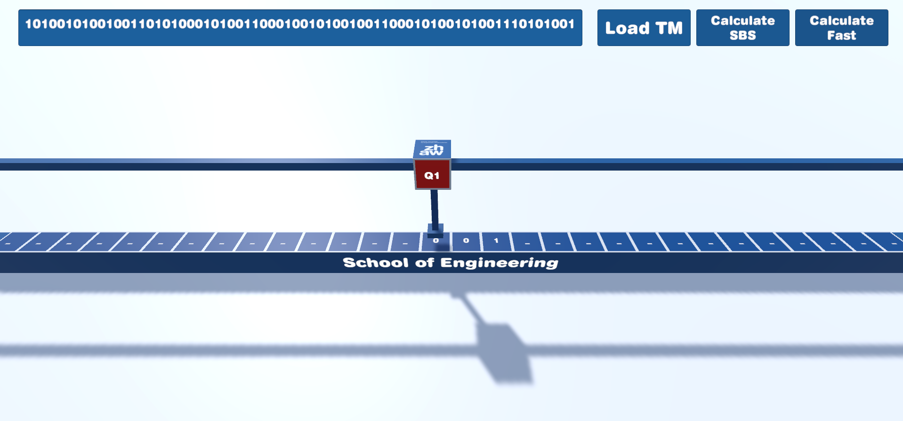

# Unity_TM
A universal turing machine simulated with Unity Version 2021.3.11f1

## Universal Turing Machine Code:
### Symbols - separated with 1's (e.g. ...1010001001...)
Can be defined by the user in the TapeManager Inspector.  
x1 : any symbol (0)  
x2 : any symbol (00)  
x3 : any symbol (000)  

### States - separated with 11's (e.g. ...110100101...)
q1 : start state (0)  
q2 : accepted state (00)  
q3... : normal state (000)  
qn : n normal states (0^n)  

### Input - separated with 111 at the end of TM (e.g ...1110100101...)
Input (Symbols) to put on the tape.  

### Direction
DL : Left (0)  
DR : Right (00)  

### Transition Format
(qn, xm) -> (qj, xk, Dl)  
0^n 1 0^m 1 0^j 1 0^k 1 0^l  
 
(e.g)  
1 001000100010100 <strong>11</strong> next transition  
(q2, x3) -> (q3, x1, R)  
Note: TM has to start with 1  
 

